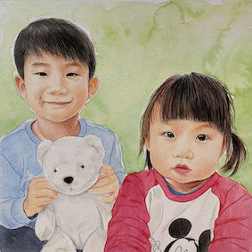

# Jaeki Hong
Engineer/Researcher, Samsung Electronics

AI&SW Center, Samsung Advanced Institute of Technology <a href="https://www.sait.samsung.co.kr/"><i class="fas fa-home"></i></a>  
Samsung-ro 130, Suwon, South Korea. 

<i class="fas fa-envelope"> E-mail: jaeki.hong@{ samsung.com | snu.ac.kr | gmail.com }</i>  
<i class="fas fa-phone"> Mobile: +82-10-8951-8158

  <a href="https://www.linkedin.com/in/jaeki-hong-39393165/"><i class="fab fa-linkedin"></i> Jaeki Hong</a>  
  <a href="https://www.instagram.com/jaeki.hong/"><i class="fab fa-instagram"></i> jaeki.hong</a>

## Education

### Formal Courses

`2020-2022`
**M.S., Computer Science & Engineering**, *Seoul National University*, Seoul, South Korea. 
- *Thunder Research Group* &nbsp;&nbsp;&nbsp;&nbsp;&nbsp;<a href="http://aces.snu.ac.kr"><i class="fas fa-home"></i></a>
- Advisor: Professor **Jaejin Lee**&nbsp;&nbsp;&nbsp;&nbsp;&nbsp;<a href="https://sites.google.com/view/jaejinlee"><i class="fas fa-home"></i></a>

`2005-2006`
**Exchange Student**, *Minnesota State University, Moorhead*, MN, United States. 

`2000-2007`
**B.S., Mathematics & Physics, (double major)**, *Chung-Ang University*, Seoul, South Korea.

### Certificates

`2018`
**Samsung-SNU Data Scientist Course(DS2)**, *Seoul National University*, Seoul, South Korea. 

`2014`
**CCAH**, *Cloudera Certified Administrator for Apache Hadoop*, United States. 
**CCDH**, *Cloudera Certified Developer for Apache Hadoop*, United States. 

## Work Experience

`2018-NOW`
**Staff Researcher**, *Samsung Advanced Institute of Technology*, South Korea.
- HPC Storage System

`2012-2018`
**Staff Engineer**, *Software Research Center, Samsung Semiconductor*, South Korea.
- Big Data, Virtualization, SSD, PHR system, IoT, Private Cloud

`2007-2012`
**Engineer**, *Storage Division, Samsung Semiconductor*, South Korea.
- 2.5" HDD Firmware

## Publications

### Conference Papers

`2017`
**J. Hong**, P. Morris and J. Seo, *Interconnected Personal Health Record Ecosystem Using IoT Cloud Platform and HL7 FHIR* 2017 IEEE International Conference on Healthcare Informatics (ICHI), 2017, pp. 362-367, doi: 10.1109/ICHI.2017.82.

Das, A. K., **Hong, J.**, Goswami, S., Platania, R., Lee, K., Chang, W., ... & Liu, L. (2017, June). *Augmenting amdahl's second law: A theoretical model to build cost-effective balanced hpc infrastructure for data-driven science*. In 2017 IEEE 10th International Conference on Cloud Computing (CLOUD) (pp. 147-154). IEEE.

`2016`
**J. Hong**, L. Li, C. Han, B. Jin, Q. Yang and Z. Yang, *Optimizing Hadoop Framework for Solid State Drives* 2016 IEEE International Congress on Big Data (BigData Congress), 2016, pp. 9-17, doi: 10.1109/BigDataCongress.2016.11.**Best Paper Awards**

`2015`
A. K. Das, S. Park, **J. Hong** and W. Chang, *Evaluating different distributed-cyber-infrastructure for data and compute intensive scientific application* 2015 IEEE International Conference on Big Data (Big Data), 2015, pp. 134-143, doi: 10.1109/BigData.2015.7363750.

`2014`
S. Ahn, S. Park, **J. Hong** and W. Chang, *Performance Implications of SSDs in Virtualized Hadoop Clusters* 2014 IEEE International Congress on Big Data, 2014, pp. 586-593, doi: 10.1109/BigData.Congress.2014.90.

### Patents

`2011`
Hard disk drive, method for operating the same, and computer system having the same, US8804256B2

`2013`
Managing device of distributed file system, distributed computing system therewith, and operating method of distributed file system, US20150120793A1

Distributed processing method, master server and distributed cluster, KR20150030036A

`2019`
Method and apparatus for optimizing model and accelerator system including apparatus for optimizing model, US20210174202A1

`2020-2021`
To be updated...

## Personal

<i class="fa fa-quote-left" aria-hidden="true"></i>Slow and steady wins the race. <i class="fa fa-quote-right" aria-hidden="true"></i>
  
<i class="fas fa-thumbs-up"></i> brompton, hiking, video games
  
<i class="fas fa-family"></i> Married, two children 

  
 Last updated: November 2021  
